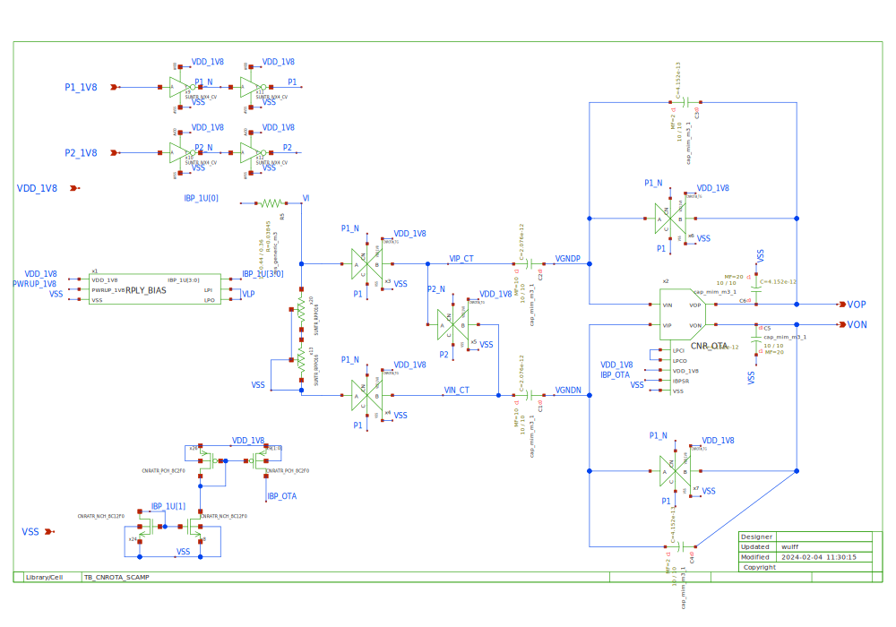
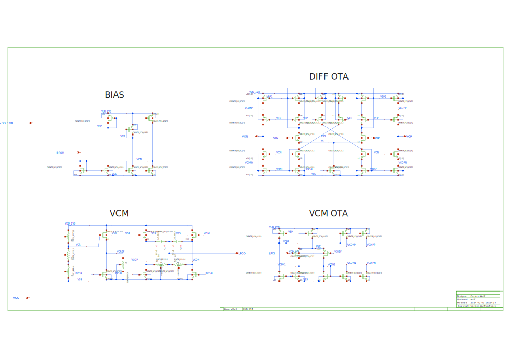

# CNR_OTA_SKY130NM

# Who
Carsten Wulff

# Why
In most books I find that CMFBs and fully differential OTAs are missing. 
When I make switched-cap examples, like TB_CNROTA_SCAMP, I need a fully differential OTA. 

# How
 My go-to fully differential current mirror OTA with a level-shifter
 based CMFB and a OTA to control the common mode.
 
 
 
 
 
 

# What

| What                    | Lib/Folder       | Cell/Name       |
|:------------------------|:----------------|:---------------|
| Schematic               | CNR_OTA_SKY130NM | CNR_OTA         |
| Example usage Schematic | TB_CNR_OTA       | TB_CNROTA_SCAMP |
| Back annotation TB      | TB_CNR_OTA       | TB_CNROTA_OP    |

Details in  [documents/schematic.md](documents/schematic.md)

# Changelog/Plan
| Version | Status | Comment|
| :-| :-| :-|
|0.1.0 | :white_check_mark: | First version |

# Signal interface
| Signal  | Direction | Domain  | Description                           |
|:--------|:---------:|:-------:|:--------------------------------------|
| VDD_1V8 | Input     | VDD_1V8 | Main supply                           |
| VIN     | Input     | VDD_1V8 | Negative input                        |
| VIP     | Input     | VDD_1V8 | Positive input                        |
| VOP     | Input     | VDD_1V8 | Positive output                       |
| VON     | Input     | VDD_1V8 | Negative output                       |
| LPCO    | Output    | VDD_1V8 | Common mode loop output               |
| LPCI    | Input     | VDD_1V8 | Common mode loop input. Short to LCPO |
| IBPSR   | Input     | VDD_1V8 | Bias current (2 uA )                  |
| VSS     | Input     | Ground  |                                       |

# Dependencies
| Library                                                                | Description                                  |
|:-----------------------------------------------------------------------|:---------------------------------------------|
| [CNR\_ATR\_SKY130NM](https://github.com/wulffern/cnr_atr_sky130nm)     | Quantized analog transistors                 |
| [SUN\_TR\_SKY130NM](https://github.com/wulffern/sun_tr_sky130nm)       | Standard digital cells and Resistors         |
| [RPLY\_BIAS\_SKY130NM](https://github.com/wulffern/rply_bias_sky130nm) | PTAT current source, used in TB_CNROTA_SCAMP |
| [tech_sky130B](https://github.com/wulffern/tech_sky130B)               | Technology setup                             |
| [cpdk](https://github.com/wulffern/cpdk)                               | Borders. Loop stability setup                |

# Key parameters
| Parameter                   | Min | Typ             | Max | Unit |
|:----------------------------|:---:|:---------------:|:---:|:----:|
| Technology                  |     | Skywater 130 nm |     |      |
| AVDD                        | 1.7 | 1.8             | 1.9 | V    |
| Temperature                 | -40 | 27              | 125 | C    |
| Loop gain (fb=500k,in=100k) | 63  | 68              | 72  | dB   |
| Bias current                |     | 2               |     | uA   |
| Current from VDD            |     | 92              |     | uA   |
| Load capacitance            | 5   |                 |     | pF   |

See [sim/CNR_OTA/README.md](sim/CNR_OTA/README.md) for detailed results

# Status

| Stage                       | TYPE | Status | Comment                        |
| :---                        | :-:  | :---:  | :--:                           |
| Specification               | DOC  | :white_check_mark:    |                                |
| Schematic                   | VIEW | :white_check_mark:    |                                |
| Schematic simulation        | VER  | :white_check_mark:    |                                |
| Layout                      | VIEW | :x:    |                                |
| Layout parasitic extraction | VIEW | :x:    |                                |
| LPE simulation              | VER  | :x:    |                                |
| LVS                         | VER  | :x:    |                                |
| DRC                         | VER  | :x:    |                                |
| ERC                         | VER  | :x:    |                                |
| ANT                         | VER  | :x:    |                                |
