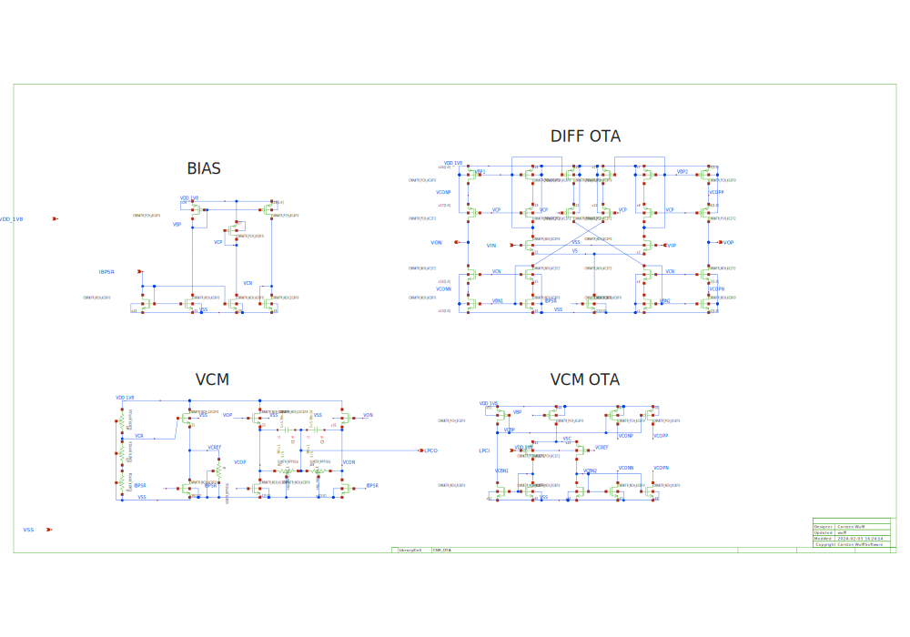
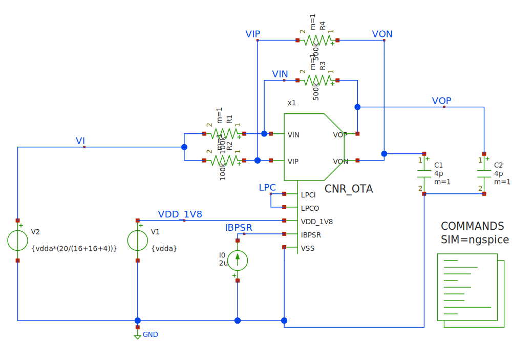

## CNR_OTA_SKY130NM/CNR_OTA.svg

For details on the transistors, see [CNR\_ATR\_SKY130NM](http://analogicus.com/cnr_atr_sky130nm/mos/all.html)

### BIAS 

Nothing special. Just a standard bias source. Take care resizing the cascode
voltages if you change stuff in the OTA 

### DIFF OTA 

Fully differential current mirror OTA. The current mirrors 
have been designed to operate in moderate to weak inversion.

The input common mode cannot be VDD/2. The threshold voltage of the 
input pair is too large for that 

### VCM OTA 

Note that I feed the output of the common mode into the cascode 
nodes on the DIFF OTA. I do this not to destroy the output impedance 
of the DIFF OTA. 

The dominant pole of the VCM OTA is also the output of the DIFF OTA

### VCM 

I've intentionally shifted the output common mode high 
in order for resistive feedback to give an input common mode 
that still keeps the tail current source of the DIFF OTA in 
saturation. 

The level-shifters would ideally have lower threshold voltage, however,
it helps to use 2F for the source followers as the NCH threshold voltage
decreases with length. 

The resistors senses the common mode, and the capacitors form a 
feedforward zero to cancel the pole of the resisistor and input capacitance
of the VCM OTA. 

The capacitor should be significantly larger than the input capacitance 
of the VCM OTA

## TB_CNR_OTA/CNROTA_TG.svg

Transmission gate.  

## TB_CNR_OTA/TB_CNROTA_OP.svg

Test bench used for operation point analysis. 

Remember to set Simulation->"Use simulation dir in schematic dir" option first

Use Netlist and Simulate in Xschem

Then Simulation->Graphs->"Annotate Operating Point into schematic"

## TB_CNR_OTA/TB_CNROTA_SCAMP.svg

Example of a switched capacitor amplifier.

RPLY\_BIAS\_SKY130NM is a PTAT current source bias. One of the 1 uA currents
is fed into a feq resistors. 

The gain of the switched capacitor amplifier is set by the relationship
between the input capacitors and the feedback capacitors.

### Phase 1

During phase 1 (P1) the small voltage is sampled onto the input capacitors. 

The OTA is in unity gain feedback, and will settle to the common mode. 

The feedback capacitors will be zeroed

### Phase 2

The transmission gate at the left side of the input caps will ensure that the 
differential charge on the input capacitors is zero.

The differential charge will move to the feedback capacitors, and as such, the 
voltage at the output will be higher, since the feedback capacitors are 
smaller than the input capacitors.

